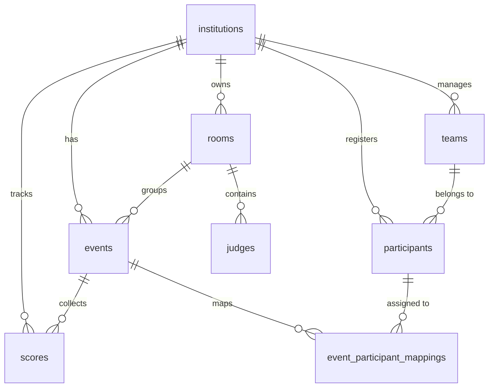
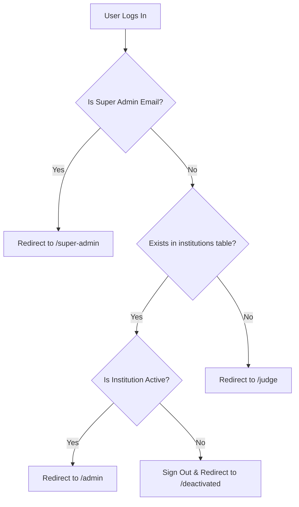

# MiladOne Documentation

Welcome to the documentation for **MiladOne**, a modern, multi-tenant, real-time competition scoring and championship management system. MiladOne is designed to let contest organizers manage rooms, judges, teams, and participants; allow judges to score participants in real-time; and allow admins to monitor live leaderboards, team standings, individual championships, and detailed participant achievement histories.

---

## Table of Contents
1. [Project Overview & Architecture](#1-project-overview--architecture)
2. [Technology Stack](#2-technology-stack)
3. [Database Schema](#3-database-schema)
4. [Authentication & Redirection Flow](#4-authentication--redirection-flow)
5. [Pages & Features](#5-pages--features)
   - [Authentication Page (`/`)](#authentication-page-)
   - [Super Admin Dashboard (`/super-admin`)](#super-admin-dashboard-super-admin)
   - [Institution Admin Dashboard (`/admin`)](#institution-admin-dashboard-admin)
   - [Judge Dashboard (`/judge`)](#judge-dashboard-judge)
   - [Deactivated Page (`/deactivated`)](#deactivated-page-deactivated)
   - [Global Footer](#global-footer)
6. [Real-time Synchronization](#6-real-time-synchronization)

---

## 1. Project Overview & Architecture

MiladOne is built on a **multi-tenant architecture** where **Institutions** represent tenants. 
- Each institution has an administrator who manages **Rooms**, **Events**, **Teams**, and **Participants**.
- A **Room** represents a physical or virtual venue where contests take place. Each room has a required number of judges (2 or 3), a unique 6-character room code, and a configurable participant code type (Numbering `1, 2, 3...` or Lettering `A, B, C...`).
- **Events**: Admin creates events before or during the competition within a room, assigning participating students to each event.
- **Participant Registration**: Chest numbers are automatically generated uniquely within each institution (`001`, `002`, `003`...).
- **Live Code Assignment**: Admins assign competition codes (Participant 1, Participant 2...) to registered students within an event.
- **Judges**: Join rooms using the 6-character access code. Judges view assigned events and score participants anonymously by code. Judges have **no permissions** to create, edit, or delete events or see student names/chest numbers.
- **Leaderboards & Achievements**: Real-time room leaderboards, institution-wide **Team Standings**, **Individual Championships**, and complete **Participant Achievement Histories** (showing all medals, grades, and championship points).

---

## 2. Technology Stack

- **Frontend Framework**: [Next.js](https://nextjs.org/) (App Router, React, TypeScript).
- **Styling & Animations**: Vanilla CSS with modern design tokens (HSL colors, glassmorphism, responsive grids) and [Framer Motion](https://www.framer.com/motion/) for smooth animations.
- **Backend & Database**: [Supabase](https://supabase.com/) (Postgres DB, GoTrue Authentication, Postgres Realtime, Row Level Security).
- **Deployment**: Configured for hosting on [Vercel](https://vercel.com/) or [Netlify](https://www.netlify.com/).

---

## 3. Database Schema

The database consists of 8 core tables inside Supabase, utilizing foreign keys with `ON DELETE CASCADE` to maintain data integrity.

### Core Tables

1. **`institutions`**: Represents tenants.
   - `id` (UUID, Primary Key)
   - `name` (Text, name of the school/college/org)
   - `admin_email` (Text, Unique, email of the Institution Admin)
   - `is_active` (Boolean, default `true`, allows Super Admin to suspend an institution)
   - `created_at` (Timestamp)

2. **`rooms`**: Groups judges and events.
   - `id` (UUID, Primary Key)
   - `institution_id` (UUID, Foreign Key → `institutions.id`)
   - `secret_code` (VARCHAR(8), Unique, 6-character room access code)
   - `judge_count_required` (Integer, restricted to `2` or `3`)
   - `code_type` (Text, default `'number'`, restricted to `'number'` or `'letter'`)
   - `created_by` (Text, Admin email)
   - `created_at` (Timestamp)

3. **`judges`**: Tracks which room a judge is currently in.
   - `id` (UUID, Primary Key)
   - `email` (Text, Judge's login email)
   - `room_id` (UUID, Foreign Key → `rooms.id`)
   - `joined_at` (Timestamp)
   - *Constraint*: Unique combination of `(email, room_id)`.

4. **`events`**: Competitive activities in a room created exclusively by admins.
   - `id` (UUID, Primary Key)
   - `room_id` (UUID, Foreign Key → `rooms.id`)
   - `institution_id` (UUID, Foreign Key → `institutions.id`)
   - `event_name` (Text)
   - `category` (Text)
   - `participant_count` (Integer, restricted to 1–30)
   - `created_by` (Text, Admin email)
   - `created_at` (Timestamp)

5. **`scores`**: Individual scores submitted by judges.
   - `id` (UUID, Primary Key)
   - `event_id` (UUID, Foreign Key → `events.id`)
   - `institution_id` (UUID, Foreign Key → `institutions.id`)
   - `judge_email` (Text)
   - `participant_number` (Integer, 1-indexed code position)
   - `score` (Integer, restricted to 0–100)
   - `created_at` (Timestamp)
   - *Constraint*: Unique combination of `(event_id, judge_email, participant_number)`.

6. **`teams`**: Institution teams for championship tracking.
   - `id` (UUID, Primary Key)
   - `institution_id` (UUID, Foreign Key → `institutions.id`)
   - `name` (Text)
   - `created_at` (Timestamp)
   - *Constraint*: Unique combination of `(institution_id, name)`.

7. **`participants`**: Contestant profiles.
   - `id` (UUID, Primary Key)
   - `institution_id` (UUID, Foreign Key → `institutions.id`)
   - `name` (Text)
   - `chest_number` (Text, auto-generated unique chest number within institution, e.g. `001`, `002`)
   - `team_id` (UUID, Foreign Key → `teams.id`, optional)
   - `created_at` (Timestamp)
   - *Constraint*: Unique combination of `(institution_id, chest_number)`.

8. **`event_participant_mappings`**: Links participant codes to registered participants.
   - `id` (UUID, Primary Key)
   - `event_id` (UUID, Foreign Key → `events.id`)
   - `participant_number` (Integer, 1-indexed code slot)
   - `participant_id` (UUID, Foreign Key → `participants.id`)
   - `created_at` (Timestamp)
   - *Constraints*: Unique `(event_id, participant_number)` and `(event_id, participant_id)`.

---

## 4. Authentication & Redirection Flow

MiladOne uses a single unified login page (`/`). Upon login (Email/Password or Google OAuth), the system checks user permissions and redirects accordingly:

- **Super Admin Email**: `rikashrikash04@gmail.com`
- **Institution Admin**: Matched dynamically via `admin_email` in the `institutions` table.
- **Judge**: Any other authenticated user.

---

## 5. Pages & Features

### Authentication Page (`/`)
- **Dual Tab Interface**: Switch seamlessly between **Sign In** and **Sign Up**.
- **Credentials Auth**: Standard email and password login with show/hide password toggle.
- **Google OAuth**: One-click registration/login with Google.
- **Auto-Routing**: Listens to session state changes and immediately routes active sessions.

---

### Super Admin Dashboard (`/super-admin`)
Accessible only by `rikashrikash04@gmail.com`.
- **System Overview Panel**: Shows total registered and active institutions.
- **Add New Institution Form**: Register new institution tenants with admin email.
- **Tenant Directory**: Toggle institution status, delete institution, and inspect active rooms.

---

### Institution Admin Dashboard (`/admin`)
The central control panel for institution staff to manage rooms, events, teams, participants, code assignments, and achievements.

- **Participant Category Selection**:
  - Assign participants to competition categories during single registration (`Kiddies`, `Sub Junior`, `Junior`, `Senior`, `General`) or bulk import (`Name, TeamName, Category`).
  - View & edit participant categories in the Participant Registry table.
- **Admin-Controlled Event Creation & Quick Category Selection**:
  - Admins create events inside rooms and select participating students.
  - **Category Quick Filters**: Filter students by event category (`Senior ⭐`, `Junior`, `Sub Junior`, `Kiddies`, etc.) inside the event creation modal.
  - **1-Click Category Selection**: Use the `⚡ Select All {Category}` button to instantly select all eligible students matching an event category without manual scrolling.
- **Flexible Chest Number Generation (Auto & Manual Options)**:
  - **Auto Generate (Default)**: Automatically assigns chest numbers based on the selected team's independent series (Team 1: 101, 102... Team 2: 201, 202... Team 3: 301, 302... No Team: 001, 002...).
  - **Manual Entry**: Option to manually enter custom chest numbers with duplicate validation across the institution.
  - **Single & Bulk Import Support**: Automatically maintains team series during single registration, inline editing, and bulk imports.
- **Bulk Import**: Paste CSV/Tab-delimited text (`Name, TeamName, Category`) to import contestants in bulk with auto-generated chest numbers.
- **Live Code Assignment**: Admins assign competition codes (Code 1, Code 2...) to actual registered participants for each event.
- **Participant Achievement Directory & History System**:
  - Track participant performance across multiple events.
  - Displays summary statistics: Total Events, Prizes Won (1st 🥇, 2nd 🥈, 3rd 🥉), Grade Counts (A/B/C), and total championship points earned.
  - Interactive Achievement History modal per participant showing detailed event breakdown.
- **Team & Individual Leaderboards**:
  - Aggregates team & individual championship points across events.
  - **Point System**:
    - **Rank Points**: 1st Place = 5 pts, 2nd Place = 3 pts, 3rd Place = 1 pt.
    - **Grade Points**: Grade A (avg ≥ 80%) = 5 pts, Grade B (avg ≥ 60%) = 3 pts, Grade C (< 60%) = 1 pt.

---

### Judge Dashboard (`/judge`)
Streamlined and simplified scoring wizard exclusively focused on entering scores. Judges have zero permissions to create or alter events or view participant identities.

- **Step 1: Join Room**: Enter 6-character room code.
- **Step 2: View Events**: Select an available event created by the room admin.
- **Step 3: Scoring Interface**:
  - Judges only see anonymous competition codes (**Participant 1, 2, 3...** or **Participant A, B, C...**).
  - Inputs (0 to 100) with score progress tracking.
- **Step 4: Submission**: Submit scores directly to the admin in real-time.

---

### Deactivated Page (`/deactivated`)
- Lock screen rendered when a suspended Institution Admin logs in.

---

### Global Footer
- Renders across key pages with official branding and hyperlink attribution: **Developed by [MeridianLabs](https://www.meridianlabss.com/)**.

---

## 6. Real-time Synchronization

MiladOne utilizes Supabase Realtime WebSocket subscriptions on PostgreSQL logical replication channels. Changes to judges, events, scores, teams, participants, or mappings trigger instant UI updates across all connected admin and judge devices without page reloads.
