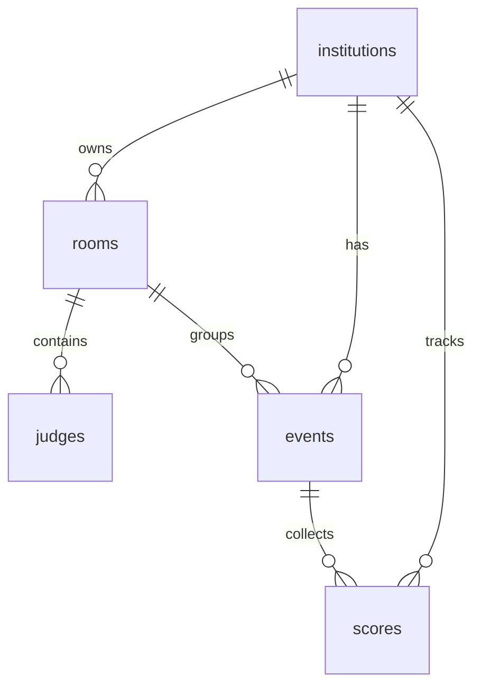
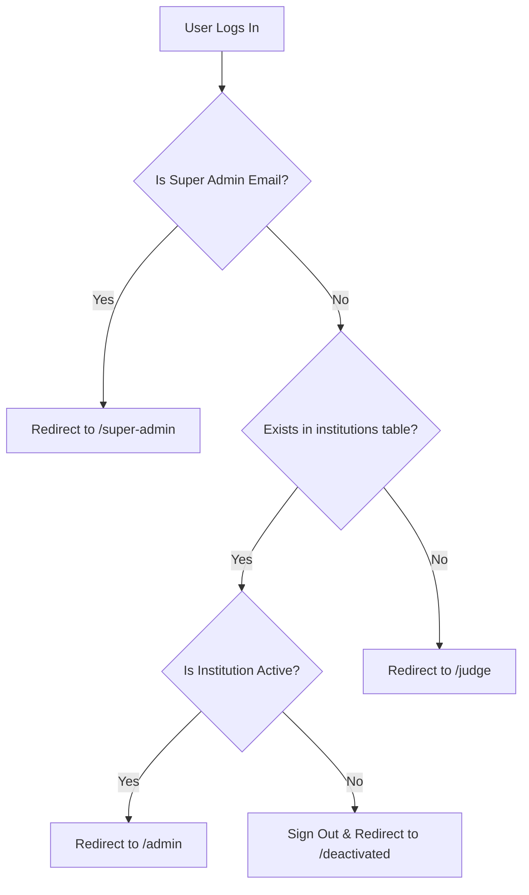

# MiladOne Documentation

Welcome to the documentation for **MiladOne**, a modern, multi-tenant, real-time competition scoring system. MiladOne is designed to let contest organizers manage rooms and judges, let judges score participants in real-time, and let admins monitor live results via an interactive leaderboard.

---

## Table of Contents
1. [Project Overview & Architecture](#1-project-overview--architecture)
2. [Technology Stack](#2-technology-stack)
3. [Database Schema](#3-database-schema)
4. [Authentication & Redirection Flow](#4-authentication--redirection-flow)
5. [Pages & Features](#5-pages--features)
   - [Authentication Page (`/`)](#authentication-page-)
   - [Super Admin Dashboard (`/super-admin`)](#super-admin-dashboard-super-admin)
   - [Institution Admin Dashboard (`/admin`)](#institution-admin-dashboard-admin)
   - [Judge Dashboard (`/judge`)](#judge-dashboard-judge)
   - [Deactivated Page (`/deactivated`)](#deactivated-page-deactivated)
6. [Real-time Synchronization](#6-real-time-synchronization)

---

## 1. Project Overview & Architecture

MiladOne is built on a **multi-tenant architecture** where **Institutions** represent tenants. 
- Each institution has an admin who manages **Rooms**.
- A **Room** represents a physical or virtual venue where contests take place. Each room has a required number of judges (either 2 or 3) and a unique, secure 6-character room code.
- **Judges** join rooms using the code.
- Within a room, judges create **Events** (e.g., "Solo Song", "Elocution").
- Judges submit **Scores** (from 0 to 100) for each participant under an event.
- The system automatically aggregates scores to compute averages, totals, percentages, and rank participants on a live leaderboard.

---

## 2. Technology Stack

- **Frontend Framework**: [Next.js](https://nextjs.org/) (App Router, React, TypeScript).
- **Styling & Animations**: Vanilla CSS with modern tokens (HSL colors, glassmorphism, responsive grids) and [Framer Motion](https://www.framer.com/motion/) for premium animations and transitions.
- **Backend & Database**: [Supabase](https://supabase.com/) (Postgres DB, GoTrue Authentication, Postgres Realtime, Row Level Security).
- **Deployment**: Configured for hosting on [Vercel](https://vercel.com/) or [Netlify](https://www.netlify.com/).

---

## 3. Database Schema

The database consists of 5 core tables inside Supabase, utilizing foreign keys with `ON DELETE CASCADE` to maintain data integrity.

### Core Tables
1. **`institutions`**: Represents tenants.
   - `id` (UUID, Primary Key)
   - `name` (Text, name of the school/college/org)
   - `admin_email` (Text, Unique, email of the Institution Admin)
   - `is_active` (Boolean, default `true`, allows Super Admin to suspend an institution)
   - `created_at` (Timestamp)

2. **`rooms`**: Groups judges and events.
   - `id` (UUID, Primary Key)
   - `institution_id` (UUID, Foreign Key → `institutions.id`)
   - `secret_code` (VARCHAR(8), Unique, 6-character room access code)
   - `judge_count_required` (Integer, restricted to `2` or `3`)
   - `created_by` (Text, Admin email)
   - `created_at` (Timestamp)

3. **`judges`**: Tracks which room a judge is currently in.
   - `id` (UUID, Primary Key)
   - `email` (Text, Judge's login email)
   - `room_id` (UUID, Foreign Key → `rooms.id`)
   - `joined_at` (Timestamp)
   - *Constraint*: Unique combination of `(email, room_id)`.

4. **`events`**: Competitive activities in a room.
   - `id` (UUID, Primary Key)
   - `room_id` (UUID, Foreign Key → `rooms.id`)
   - `institution_id` (UUID, Foreign Key → `institutions.id`)
   - `event_name` (Text)
   - `category` (Text)
   - `participant_count` (Integer, restricted to 1–30)
   - `created_by` (Text, creator's judge email)
   - `created_at` (Timestamp)

5. **`scores`**: Individual scores submitted by judges.
   - `id` (UUID, Primary Key)
   - `event_id` (UUID, Foreign Key → `events.id`)
   - `institution_id` (UUID, Foreign Key → `institutions.id`)
   - `judge_email` (Text)
   - `participant_number` (Integer, e.g. Participant 1, Participant 2)
   - `score` (Integer, restricted to 0–100)
   - `created_at` (Timestamp)
   - *Constraint*: Unique combination of `(event_id, judge_email, participant_number)`.

### Security: Row Level Security (RLS)
The database enforces strict RLS policies to prevent unauthorized data access:
- **Super Admin**: Bypasses restrictions on all tables.
- **Institution Admin**: Can only view and edit data (rooms, judges, events, scores) that belong to their specific `institution_id`.
- **Judges**: Can only view events and rooms they belong to, and can only insert/edit their own scores.

---

## 4. Authentication & Redirection Flow

MiladOne uses a single unified login page (`/`). Upon successful login (either via Email/Password or Google OAuth), the system checks the user's email against database privileges and redirects them to the correct dashboard:

- **Super Admin Email**: `rikashrikash04@gmail.com`
- **Institution Admin**: Determined dynamically if their email matches `admin_email` in the `institutions` table.
- **Judge**: Any other user.

---

## 5. Pages & Features

### Authentication Page (`/`)
A visually premium landing page built with custom HSL variables, fluid gradients, floating glassmorphism blobs, and full desktop/mobile responsiveness.
- **Dual Tab Interface**: Switch seamlessly between **Sign In** and **Sign Up**.
- **Credentials Auth**: Standard email and password login. Includes a show/hide password toggle button.
- **Google OAuth**: One-click registration/login with Google.
- **Auto-Routing**: Listens to session state changes and immediately logs in/redirects active sessions.

---

### Super Admin Dashboard (`/super-admin`)
Accessible only by `rikashrikash04@gmail.com`. It provides complete oversight of the platform.

- **System Overview Panel**: Shows the total number of registered institutions and how many are currently active.
- **Add New Institution Form**:
  - Lets the Super Admin register a new tenant by inputting their name (e.g. "School A") and the administrator's email.
- **Tenant Management Directory**:
  - Displays a detailed list of all institutions.
  - **Deactivate/Activate Action**: Instantly toggle the status of an institution. Deactivating it blocks that administrator from logging in.
  - **Delete Action**: Permantently deletes the institution and cascades deletion to remove all rooms, judges, events, and scores.
  - **Dynamic Details Panel**: Expand any institution row to lazy-load its current state:
    - Lists active rooms and their 6-letter secret codes.
    - Shows how many judges have joined a room (e.g., `2/3 judges`).
    - Lists the emails of connected judges.
    - Lists all events created, their categories, participant count, and the number of submitted score entries.

---

### Institution Admin Dashboard (`/admin`)
Designed for contest organizers/institution staff to manage rooms and view real-time leaderboards.

- **Real-Time Integration**: Synchronizes automatically with Supabase Postgres change notifications. Updates to judges joining, scores being submitted, or events being created are pushed to the UI instantly without page reloads.
- **Key Metric Indicators**: Cards showcasing total rooms created, total judges registered, total events created, and total score entries logged.
- **Create Room Form**:
  - Lets admins specify the required number of judges (either `2` or `3`) for the contest.
  - Automatically generates a unique, clash-free 6-character uppercase code (e.g. `K2X8P9`).
- **Sidebar Drawer Navigation**:
  - Features a sliding navigation bar with a responsive hamburger button on mobile.
  - Lists all rooms created. Each room shows a live status dot: **green** if the room has reached the required judge capacity, **orange** if it's waiting for judges.
- **Room Detail Overview**:
  - **Judges List**: Monitor who has joined. The admin has the power to remove/kick a judge from the room.
  - **Events Registry**: List of all events in the room, showing categories, participant counts, creators, and creation dates.
- **Interactive Live Leaderboard**:
  - Pulls in judge submissions in real time.
  - Automatically ranks participants from highest total score to lowest.
  - Highlights top positions with medals (🥇, 🥈, 🥉).
  - Displays a matrix grid containing individual scores from each judge (color-coded: green for >=80, red for <50).
  - Calculates total cumulative scores and converts them into percentages.
  - Displays animated progress bars (gold for 1st place, purple/blue for other participants).
  - Indicates the exact timestamp of the last submitted score.

---

### Judge Dashboard (`/judge`)
Optimized for mobile use so judges can score contestants easily from their phones. It uses a step-by-step wizard indicator at the top (`Join Room` → `Events` → `Scoring` → `Done`).

- **Step 1: Join Room**:
  - Judges type the 6-character room code.
  - The system automatically registers the judge in the room.
  - Safeguard: Prevents entry if the room is already full (exceeds 2 or 3 required judges).
- **Step 2: Room Events**:
  - Displays a card directory of all active events in the room.
  - **Create Event**: Judges can create a new event by providing:
    - Event Name.
    - Category: Choose from a dropdown (`Kiddies`, `Sub Junior`, `Junior`, `Senior`, `Super Senior`, or `Other` which opens a text input for custom categories).
    - Participant Count: Number of competitors (from 1 to 30).
- **Step 3: Scoring Page**:
  - Shows custom inputs labeled `Participant 1`, `Participant 2`, etc.
  - Judges input scores from 0 to 100.
  - **Dynamic Input Validation**: Text inputs glow red if scores exceed 100 or fall below 0. Color indicators label scores (green for high, blue for average, red for low).
  - **Progress Visualizer**: Shows a running tally of points entered vs. maximum points possible, backed by a progress bar.
  - **Smart Upsert**: Submitting scores writes them to the database. If a judge edits their scores and re-submits, it updates the existing rows rather than creating duplicates.
- **Step 4: Success Screen**:
  - Renders a success celebration screen.
  - Gives the option to **Score Another Event** (returns to Step 2) or **Create New Event** (returns to Step 3).
- **Leave Room Action**: Allows judges to leave the current room so they can enter a new one. Their previously recorded scores remain saved in the database.

---

### Deactivated Page (`/deactivated`)
- A secure lock screen page.
- Renders when a suspended Institution Admin logs in.
- Provides a clean sign-out action and details the support email for reactivation.

---

## 6. Real-time Synchronization

One of MiladOne's standout features is its **instant reactivity**. By utilizing Supabase Realtime (built on PostgreSQL logical replication), the frontend establishes WebSocket connections to listen for specific insert, update, or delete commands.

- **For Admins**: As soon as a judge submits scores or a new judge enters a room, the Admin leaderboard recalculates and animations trigger immediately.
- **For Judges**: When a colleague creates a new event, it immediately appears on the events selection page without needing a refresh.
